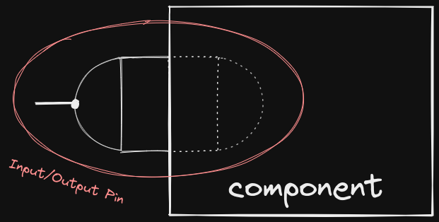

# Pins

> **Note** The term power here is used in a colloquial manner rather than
> conforming to the definitions in physics. e.g. "The pin is powered on"

A pin can be of two types:

- Input Pin
- Output Pin

A general purpose pin class could be created but to keep the code simpler I have
chosen to segregate the two types of pins. An input pin will never have it's
power state set to ON because of internal power (i.e. the component it is bound
to is providing the power to the pin), it's state relies solely on the wire
attached to it (if any). Whereas, the output pin can have internal power and in
normal circuits the wire it is connected to will not be providing it power.
If the pin has power from both the component it is bound to and the wire, then
there exists no potential difference and no electricity will flow between the
two pins connected by the wire.

In terms of code, I am not modelling electrical flow rather it's a push
notifications type of model. If pin A is an output pin with internal power
ON and pin B is an input pin, and they are both connected by a wire, then if pin
A turns off then it will send a push notification to the wire which will then
send a push notification to pin B and any parallely connected wires it might
have.